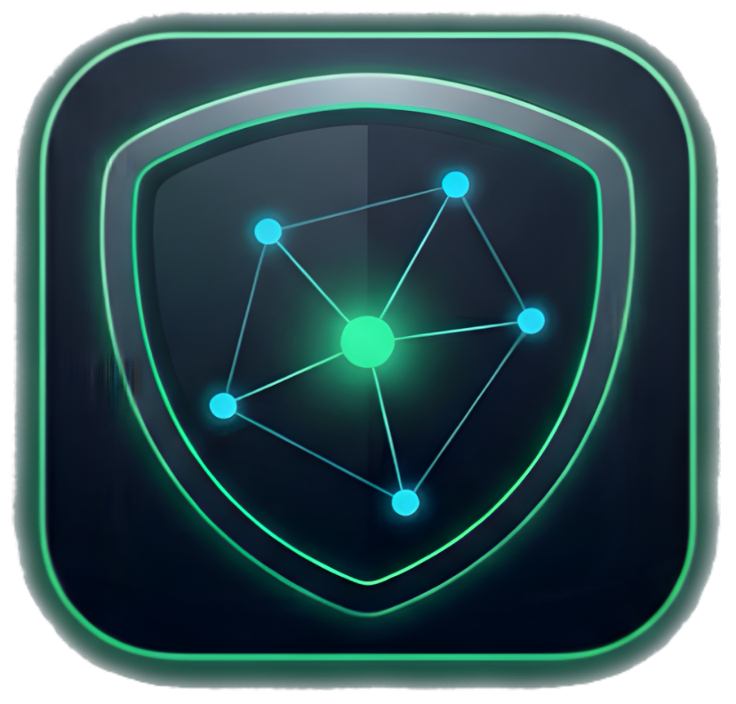

<p align="center">
  
</p>

<h1 align="center">ClawNex</h1>

<p align="center"><strong>One nexus. Total control.</strong></p>

<p align="center">
  <a href="https://github.com/ClawNexAi/clawnex/actions/workflows/ci.yml"></a>
  <a href="https://github.com/ClawNexAi/clawnex/actions/workflows/codeql.yml"></a>
  <a href="LICENSE"></a>
  <a href="DCO"></a>
  <a href="https://github.com/ClawNexAi/clawnex/releases/tag/v0.15.7-alpha"></a>
</p>

ClawNex is a local-first security control plane for AI agents. It connects to OpenClaw and Hermes on the same host, routes supported model traffic through a pinned LiteLLM proxy, applies Prompt Shield policy, and gives operators one place to investigate alerts, fleet posture, trust boundaries, cost, and audit evidence.

**Current release:** [`v0.15.7-alpha`](https://github.com/ClawNexAi/clawnex/releases/tag/v0.15.7-alpha) · Public alpha · macOS and Linux

[Website](https://clawnexai.com) · [Documentation](https://docs.clawnexai.com) · [Product gallery](https://clawnexai.com/gallery) · [Releases](https://github.com/ClawNexAi/clawnex/releases)

## Getting Started

ClawNex is intended for a host that runs OpenClaw, Hermes, or both. The interactive installer checks dependencies, recommends a deployment mode, asks for confirmation, configures authentication and an optional model provider, builds the application, and starts the appropriate service layer.

### Requirements

- macOS or a systemd-based Linux distribution
- Node.js 22 recommended; Node.js 18 is the enforced minimum
- Python 3.10 or newer; Python 3.12 is the validated target
- Git
- An existing OpenClaw and/or Hermes installation for agent telemetry and routing

```bash
git clone https://github.com/ClawNexAi/clawnex.git clawnex
cd clawnex
bash install.sh
```

The installer can configure OpenRouter, Anthropic, OpenAI, or NVIDIA NIM, or leave provider setup for the dashboard.

| Install mode | Exposure | Service layer | Authentication |
|---|---|---|---|
| **macOS local** | `localhost:5001` | launchd | Choose RBAC or localhost-only mode |
| **macOS server** | Public domain | launchd + Caddy + TLS | RBAC |
| **Linux local / VNC** | `localhost:5001` | systemd | Choose RBAC or localhost-only mode |
| **Linux VPS** | Public domain | systemd + Caddy + Let's Encrypt + UFW | RBAC |

When RBAC is enabled, the installer prints a one-time setup URL for creation of the first administrator. Public deployments bind the application and LiteLLM to localhost behind Caddy.

For unattended installation flags and production prerequisites, see the [deployment guide](docs/12-deployment-guide.md) and [VPS quickstart](docs/15-vps-deployment-quickstart.md).

### Uninstall

From the ClawNex checkout:

```bash
bash scripts/uninstall.sh
```

The uninstaller confirms destructive actions, offers database archival and documentation preservation, stops ClawNex services, restores ClawNex-managed routing where possible, and removes the selected installation.

## What ClawNex Does

| Operator surface | What it provides |
|---|---|
| **Mission Control** | Fleet posture, evidence confidence, policy coverage, cost risk, alert aging, and a prioritized action queue. |
| **Investigation Workbench** | Overview, payload, detection analysis, related activity, and decision views with evidence links and audited operator actions. |
| **Prompt Shield** | 163 built-in detections plus enabled operator-authored policies for injection, jailbreak, exfiltration, credential exposure, steganography, unsafe commands, and sensitive paths. |
| **OpenClaw and Hermes** | Local connector health, sessions, agents, provider inventory, routing state, and selective routing for supported API-based providers. |
| **Traffic Monitor** | Source, model, provider, verdict, score, latency, tokens, and request status for observed model traffic. |
| **Correlations** | Higher-order findings across Shield events, alerts, traffic, audit activity, cost, trust, and collector health. |
| **Trust and Blast Radius** | Reachable surfaces, agent capabilities, dangerous tool combinations, confidence labels, findings, and remediation guidance. |
| **Host Security** | Local host and installation checks, OpenClaw CVE awareness, posture scoring, and remediation guidance. |
| **Access and Evidence** | RBAC, passkeys, optional GitHub OAuth and Magic Link, break-glass controls, risk acceptance, audit history, and report exports. |
| **Token and Cost Intel** | Provider, model, agent, and session visibility with explicit trust labels and abnormal-spend signals. |

The sidebar keeps up to **five Favorites** and the last **three Recent** panels per operator in the current browser, making active investigation paths easier to revisit.

## Traffic And Routing Boundaries

ClawNex protects traffic only when that traffic passes through a supported inspection path:

1. OpenClaw or a writable Hermes custom provider sends an API-based model request through the local LiteLLM proxy.
2. ClawNex scans the request and response using built-in Shield detections and enabled policy rules.
3. The resulting verdict is `ALLOW`, `REVIEW`, or `BLOCK`.
4. Traffic metadata, detections, alerts, and audit events are stored in the local ClawNex database for operator review.

OAuth- and session-bound provider traffic cannot always be transparently proxied because the client owns the authentication channel. ClawNex marks those paths read-only and can provide retrospective visibility when a supported local watcher can observe the session data. A `DIRECT` route is visible but is not receiving real-time Prompt Shield inspection.

ClawNex currently supports same-host operation. A supported remote collector or remote traffic bridge is not part of `v0.15.7-alpha`.

## Current Release

`v0.15.7-alpha` adds operator-scoped navigation Favorites and Recents, improves nested-panel contrast and sidebar legibility, and includes the investigation and evidence workflows delivered in the current `0.15` release line.

See the [GitHub release](https://github.com/ClawNexAi/clawnex/releases/tag/v0.15.7-alpha) and [changelog](CHANGELOG.md) for release-by-release detail.

## Architecture

A standard installation contains four core runtime components:

```text
OpenClaw / Hermes
        |
        | supported API traffic
        v
ClawNex + Prompt Shield ---> LiteLLM proxy ---> Model provider
        |
        +-- SQLite operational and audit data
        +-- Dashboard and API on localhost:5001
```

- **Next.js 16 / React 18** provide the dashboard and API layer.
- **SQLite with `better-sqlite3`** stores configuration, alerts, traffic metadata, evidence, and audit events locally.
- **LiteLLM 1.84.10** is the pinned and verified proxy version. ClawNex does not depend on nightly LiteLLM builds.
- **launchd or systemd** keeps local services running.
- **Caddy** terminates HTTPS for public server modes.

Public architecture references:

- [Infrastructure architecture](docs/25-public-infrastructure-architecture.md)
- [High-level architecture](docs/26-public-high-level-architecture.md)
- [Low-level architecture](docs/27-public-low-level-architecture.md)
- [API and MCP integration guide](docs/28-public-api-mcp-integration-guide.md)

## Security Model And Limitations

ClawNex is security software, but it is not a security guarantee. Operators remain responsible for provider configuration, host hardening, access review, backups, policy tuning, and validation in their own environment.

- Public and server installs enable RBAC and HTTPS by default.
- Local installs can use RBAC or explicit localhost-only mode.
- Service ports `5001` and `4001` bind to localhost in supported deployments.
- Security-sensitive operator and system actions are recorded in the audit trail.
- Evidence retention and forensic capture are configurable; sensitive content should be minimized and protected according to local policy.
- Built-in rules can produce false positives and false negatives. Use Shield Tests, investigation evidence, and controlled policy changes to validate behavior.
- SQLite audit records are locally controlled operational evidence; this release does not claim external immutability or independent notarization.
- High availability, multi-tenant isolation, SAML/SSO, and external SIEM delivery are not shipped in this alpha.

Read the [security validation summary](docs/security-validation-summary.md), [security assessment summary](docs/security-assessment-summary.md), and [security roadmap](docs/security-roadmap.md). Report vulnerabilities privately through [SECURITY.md](SECURITY.md) or `security@clawnexai.com`.

## Documentation

| Need | Start here |
|---|---|
| Install or deploy | [Deployment guide](docs/12-deployment-guide.md) |
| Deploy on a VPS | [VPS quickstart](docs/15-vps-deployment-quickstart.md) |
| Learn daily operation | [Basic user manual](docs/06-basic-user-manual.md) |
| Configure advanced controls | [Advanced user manual](docs/07-advanced-user-manual.md) |
| Operate and support a host | [Support operations manual](docs/08-support-operations-manual.md) |
| Use the API | [API reference](docs/10-api-reference.md) |
| Understand stored data | [Data dictionary](docs/14-data-dictionary.md) |
| Integrate with API or MCP | [API and MCP guide](docs/19-api-mcp-integration-guide.md) |
| Troubleshoot | [Troubleshooting guide](docs/17-troubleshooting-guide.md) |
| Use keyboard navigation | [Keyboard shortcuts](docs/22-keyboard-shortcuts.md) |
| Follow planned improvements | [Public roadmap](ROADMAP.md) |

The hosted operator documentation is at [docs.clawnexai.com](https://docs.clawnexai.com).

## Development

Node.js 22 remains the safest recommended development target. Exact npm and Python dependencies are pinned in the repository.

```bash
git clone https://github.com/ClawNexAi/clawnex.git clawnex
cd clawnex
npm ci
python3 -m venv litellm/venv
source litellm/venv/bin/activate
pip install -r litellm/requirements.txt
npm run dev
```

The development server listens on `http://localhost:5001`.

```bash
npm run lint
npm run build
npm run verify:investigation-workbench
npm run verify:security-remediation
npm run sbom
```

## Versioning And Support

ClawNex follows Semantic Versioning with pre-release suffixes. Alpha releases can change APIs, configuration keys, schemas, and operator workflows without backward-compatibility guarantees. Review the changelog before upgrading and test upgrades against a copy of operational data.

- Bugs and feature requests: [GitHub Issues](https://github.com/ClawNexAi/clawnex/issues)
- Planned improvements: [Public roadmap](ROADMAP.md) and [live GitHub Project](https://github.com/orgs/ClawNexAi/projects/1)
- Security reports: `security@clawnexai.com`
- Support, documentation, legal, commercial, and general inquiries: `contact@clawnexai.com`

## Contributing

Contributions are welcome. Read [CONTRIBUTING.md](CONTRIBUTING.md), create a focused branch, run the relevant verification commands, and sign off every commit under the Developer Certificate of Origin:

```bash
git commit -s -m "Describe your change"
```

## License

ClawNex is released under the [Apache License 2.0](LICENSE). Contributions require [DCO](DCO) sign-off. Third-party attribution is recorded in [NOTICE](NOTICE).

---

<p align="center">ProBizSystems · <a href="https://clawnexai.com">clawnexai.com</a></p>
